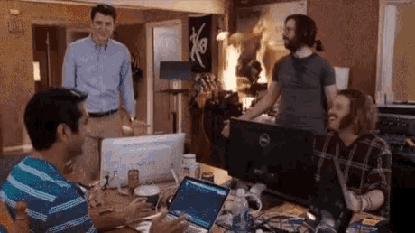
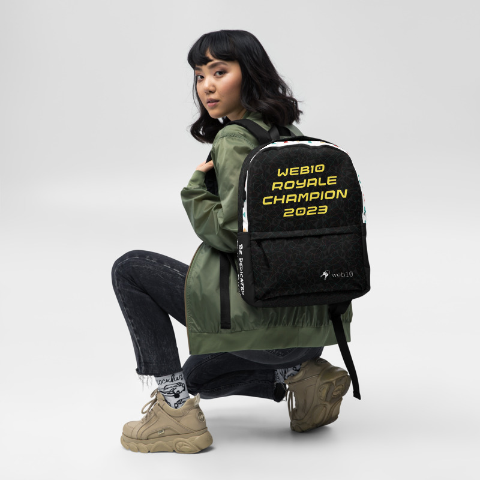

# 🤖🌠 The web10 Inventors Royale📀💯

The web10 Inventors Royale is a semester long program to expose students to real world software development patterns, practices, management, and teamwork.

 🎆 *You can do anything* 💯 *If you put your mind to it* 📣 *so let's work hard*  😎

|  |  |  |
| ------------------------------------------------------------ | ------------------------------------------------------------ | ------------------------------------------------------------ |

> How will it work ❓

Students will work together collaboratively in teams to make full stack web applications.

> I have not failed. I’ve just found 10,000 ways that won’t work.

[ - Quote By Thomas Edison ](https://blackmousedesign.com.au/2014/05/stop-procrastinating/i_have_not_failed_edison/)

## Details

The program will be run as a fun and friendly contest. Teams will be judged by a panel of faculty judges. At the end of the program, a winning team will be chosen, and will win web10 Royale backpacks. To participate in the contest, there will be three teams to choose from.

Team Options : 

* Real Time Player Versus Player 3D Game Team (Ball Shooter) 🔫 🥎🤖
* 3D Creative Sculpting Game [Voxel Painter] 🎨🎁🪐
* High Speed Decentralized Social Media App < web10 Social > 🦜💭💬

The applications that each team will make will be published to an app store made custom for your school, with your school's logo.

At the end of the summer, the students will present their apps, and a panel of faculty judges will score team performance. One team will be declared the winner.

## Scoring

The apps will be graded from 1 to 10 on the following criteria :

**functionality** - How impressive is the functionality that each team added to their respective apps?

**product design** - How impressive are the visual design improvements that each team made?

**management** - How good was the team work? was there effective delegation of tasks, planning, and execution? 

**presentation** - How good was team's slide deck / oral presentation of their app?

### Prize

Members of the winning team will get web10 Royale Champion backpacks.

