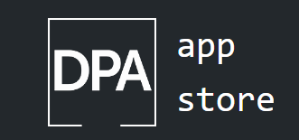

# 🤖🌠 DPA Summer Metaverse 📀💯

This school year, DPA will be running a Summer program to expose students to real world software development patterns, practices, management and teamwork.

 🎆 YOU CAN DO ANYTHING 💯 IF YOU PUT YOUR MIND TO IT 📣 ESPORTS GRINDSET  😎

|  |  |  |
| ------------------------------------------------------------ | ------------------------------------------------------------ | ------------------------------------------------------------ |

> How will it work ❓

Students will work together collaboratively in teams to make full stack web applications.

> I have not failed. I’ve just found 10,000 ways that won’t work.

[ - Thomas Edison ](https://blackmousedesign.com.au/2014/05/stop-procrastinating/i_have_not_failed_edison/)

Team Options : 

* Real Time Player Versus Player 3D Game Team (Ball Shooter) 🔫 🥎🤖
* 3D Creative Sculpting Game [Voxel Painter] 🎨🎁🪐
* High Speed Decentralized Social Media App < web10 Social > 🦜💭💬

The applications will be published to the brand new Digital Pioneers Academy App Store. The apps will be tracked for usage!

At the end of the summer, the students will present their apps, and a panel of faculty judges will vote on one of the three applications. One team will be declared the winner.

